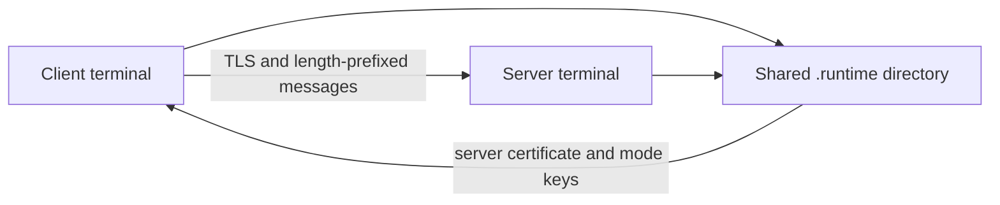

# Architecture

`main.py` chooses the role and mode. The server creates a fresh self-signed certificate for `localhost` each run, then accepts one TLS connection. The client loads that certificate as its trust anchor and verifies the server name. Both sides send each message as a four-byte network-order length followed by a payload, so reads can handle partial TCP records.

In `none` mode the payload is UTF-8 text inside TLS. In `symmetric` mode it is a Fernet token using a shared key. In `asymmetric` mode it is RSA-OAEP ciphertext encrypted to the peer's public key. The server generates a new symmetric or RSA key for each run; the client generates its own RSA key in asymmetric mode. Key files are shared through `.runtime` because this is a same-machine demo.
